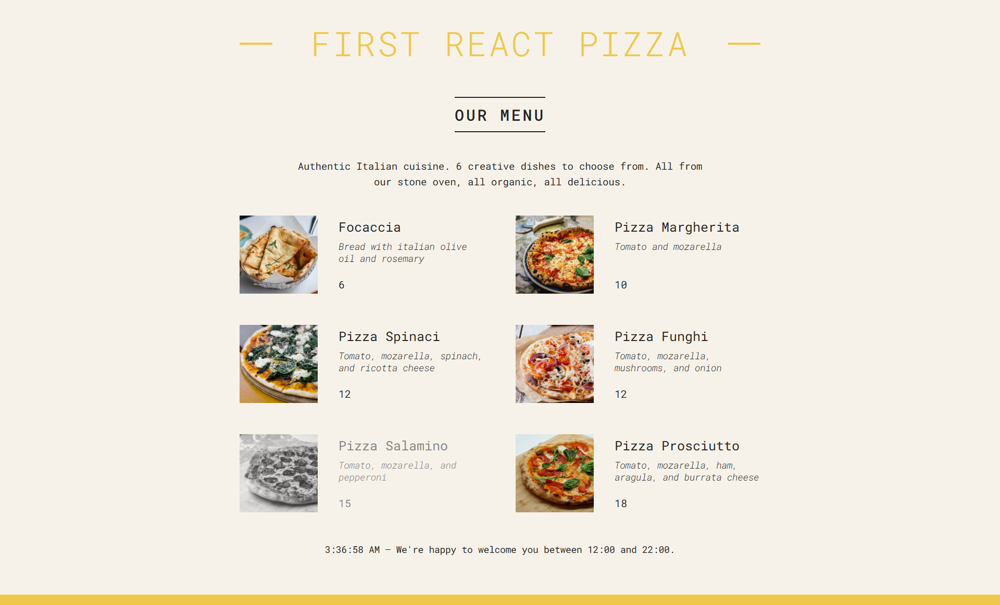

# 🍕 First React Pizza

A dynamic pizza restaurant UI built with React. Displays a curated pizza menu with live open/closed status depending on the time of day.

### 🌐 Live Demo

👉 [Try the live Demo!](https://nkieu-react-pizza.vercel.app/)

---

## 📸 Screenshots



---

## 🚀 Features

- 🧾 **Menu Display**: Dynamically render pizzas from a `pizzaData` array.
- 🧑‍🍳 **Conditional Availability**: Pizzas can show as **sold out**, with visual indication.
- ⏰ **Real-Time Footer Logic**: Footer adapts based on restaurant open hours (12:00 - 22:00).
- 🖼️ **Component Composition**: Modular and reusable components: `Header`, `Menu`, `Pizza`, `Footer`, `Order`.
- 🧩 **JSX Fragments**: Use of fragments for cleaner HTML structure when returning multiple siblings.
- 🧠 **Clean UX**: Messages for both menu availability and business open/close times.

---

## 🧠 Learning Goals

This project is designed to deepen core React fundamentals, including:

- **React Component Structure** and composition
- **useState** (for future state-driven features)
- **Conditional Rendering** based on time and data
- **Props Passing** to child components
- **Array Mapping** with `.map()` and `key` usage
- Applying **JSX Best Practices**: class names, expressions, fragments
- Understanding real-time logic using `Date` objects in React

---

## 🛠️ Technology Stack

- React (v18+)
- JavaScript (ES6+)

---

## 🚀 Installation & Setup

1. **Clone the repository**

   ```bash
   git clone https://github.com/nkieu-config/react-pizza-project.git
   ```

2. **Install dependencies**

   ```bash
   npm install
   ```

3. **Start development server**

   ```bash
   npm run dev
   ```

⚠️ Requires Node.js and npm installed.

---

## 📚 Course Credit

This project was developed as part of **[The Ultimate React Course 2025](https://www.udemy.com/course/the-ultimate-react-course/)** by [Jonas Schmedtmann](https://codingheroes.io/)

---

## 📃 License

This is a personal learning project and not intended for production use.
